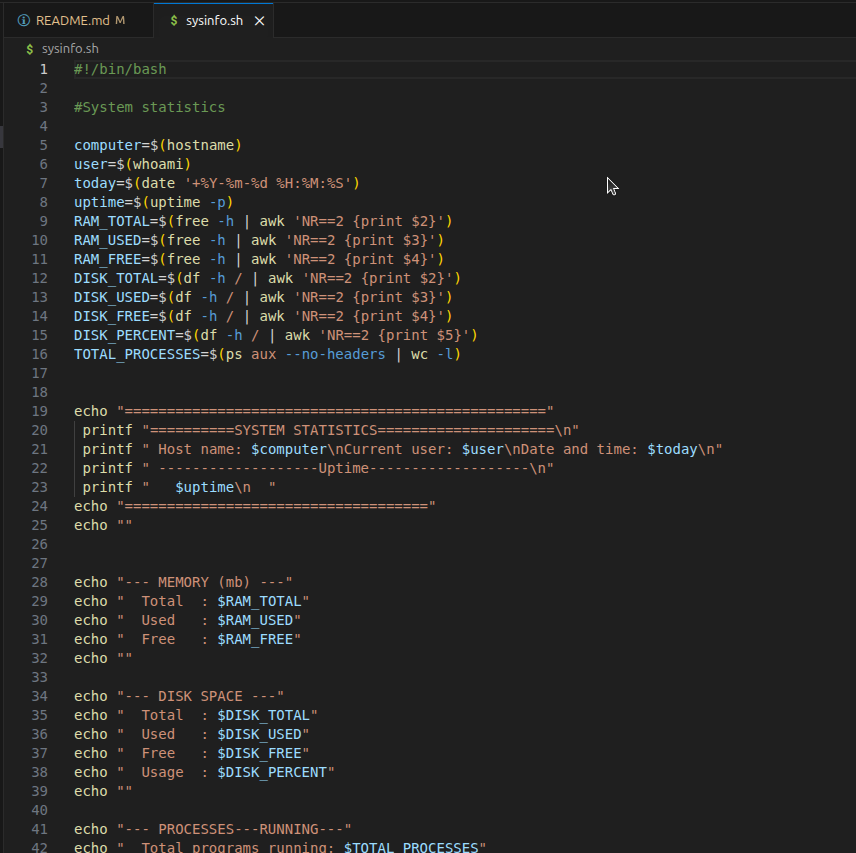
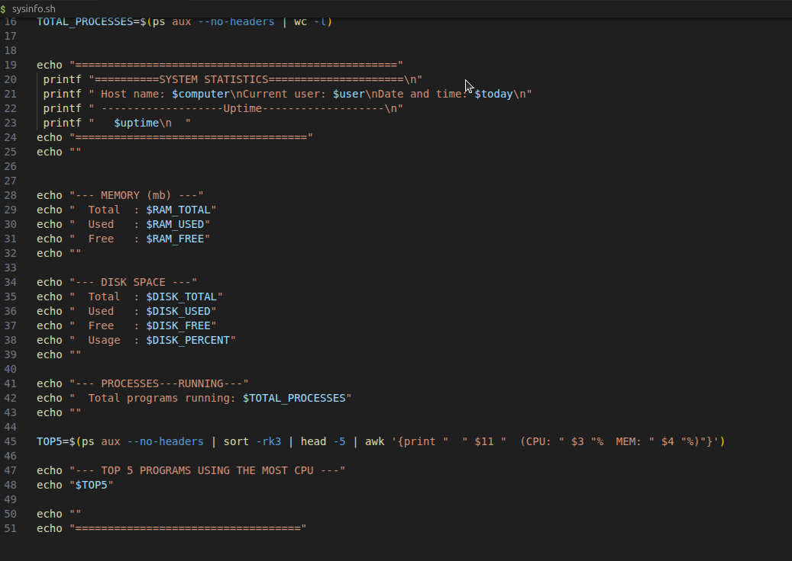

 🏷 Project Name

> Short one-line description of what this project does.
The bash script will access the system information and display it to the user. It is run by using ./sysinfo.sh. 

---

## 📌 Problem Statement

Describe the real-world problem this project solves.
it takes less than a minute to display all the information that could be obtained manually by the user.

---

## 🎯 Project Goals

- Displays System Identity, uptime and date
- Displays memory usage informetion
- Displays disk usage information
- Counts the number of running processes and displays the top 5
- Runs without errors
- Displays all required sections
- Formats output clearly

---

## 🛠 Tech Stack

**Backend:**
- Bash

**Other Tools:**  
- Git & GitHub  

---

## 🖥 Features

- Using built-in Linux command-line tools
- Command substitution ($(...))
- String formatting
- Basic math and data parsing
- Organizing output cleanly
---

## 📷 Screenshots

(Add screenshots here)



---

## ⚙ Installation & Setup

Clone the repository:

```bash
git clone https://github.com/Stanice-netizen/system_info
cd sysinfo.sh
Install dependencies:
npm install
Run the project:
npm start

🧠 Challenges Faced

Display disk usage and memory usage

📚 What I Learned

Display disk usage and memory usage

 Future Improvements
Add command-line flags: --compact or --verbose
Add color-coded warnings for low disk/memory
Save output to a log file
Display CPU usage

👨🏽‍💻 Author
Your Losha Stanice
Junior Fullstack Developer
📩 Email: kieramaxswell@gmail.com
🌍 Based in Cameroon | Open to remote opportunities

